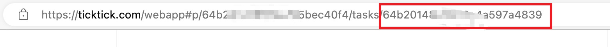

# TickTick Sync for Obsidian

Importing from TickTick to Obsidian(one way sync)

> `dida`: Chinese name of ticktick

[中文](./README.md)

## Quick Start

0. Enter your TickTick account and password in the settings.
1. Create a note and add the following configuration to the front matter:

```
---
ticktick: true
---
```
2. Execute the command `Dida Todo Sync: Sync ToDo List`. 

**Default Behavior**

- Sync all todos within the past six months (regardless of completion status) by default.
- Sort by time in descending order.


# Configuration  

Configuration in the front matter of the note

- ticktick: Whether to enable TickTick synchronization for this note
  - projectId: Project ID, get the content under the specified list, projectId needs to be obtained from the web version of TickTick
  
  - tags: get content containing specified tags, array type
  - excludeTags: 
  - startDate: Synchronize content from which day to now. The default is six months ago.
  - taskId: task id sync specified task
    
  - status: task status, supports `uncompleted` and `completed`

## Example

(require Obsidian 1.4.0)

**Simple configuration**
```
ticktick: true
```


**Configure projectId and tags**

```
ticktick.projectId: xxx
ticktick.tags:
    - tag1
    - tag2
ticktick.startDate: 2023-01-01
```


### Deprecated configuration style

**Simple configuration**

```
ticktick: true
```

**Configure projectId and tags**

```
ticktick: 
  projectId: xxx
  tags: 
    - 标签1
    - 标签2
  startDate: 2023-01-01
```
(Note that the indentation is 2 spaces)
