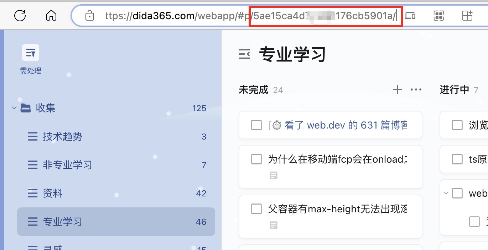
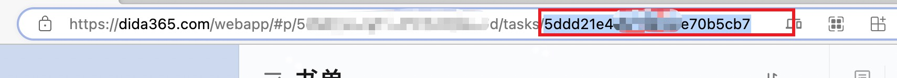

# 滴答清单同步

单向同步(滴答清单->obsidian)


if you use ticktick read this!!!! -> [English](./README.EN.md)

## 快速手上

0. 在配置中输入滴答清单账号密码

1. 创建一个笔记,在笔记头部加上配置
```
---
dida: true
---
```
2. 执行命令`Dida Todo Sync: 同步待办`
**默认行为**

- 默认同步半年内的所有待办(包括已完成,未完成,不包括放弃的)
- 按时间降序排序

# 配置
配置在笔记头部的front-matter

- dida: 这篇笔记是否开启滴答清单同步
    - projectId: 项目id, 过滤出指定清单下的内容, projectId需要到滴答清单web版获取
    
    - tags: 过滤出包含指定标签内容, 数组类型
    - startDate: 同步从哪天开始到现在的内容. 默认是半年前
    - taskId: 任务id,同步指定任务
    
    - status: 任务状态,支持 `uncompleted` 和 `completed`


## 举例

**简单配置**

```
dida: true
```

**配置projectId和tags**

```
dida: 
  projectId: xxx
  tags: 
    - 标签1
    - 标签2
  startDate: 2023-01-01
```
(注意缩进是2个空格)

# TODO  

- [x] star过10个补充文档
- [x] star过20支持ticktick, 上架obsidian([进行中](https://github.com/obsidianmd/obsidian-releases/pull/2193))
